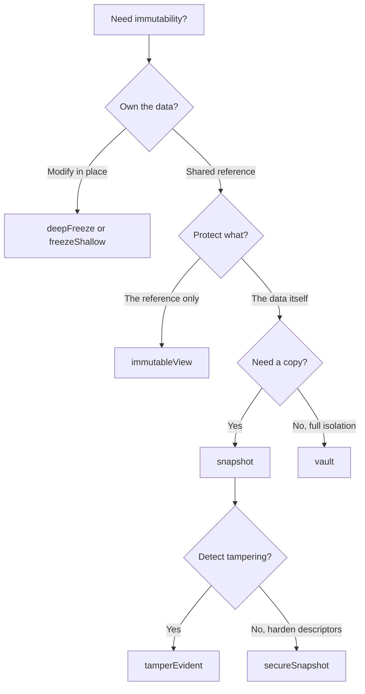

# Choose the Right Model

Constancy gives you 5 mental models. Pick ONE per use case.

The most common mistake is using `immutableView` when you need `snapshot` — the [VIEW vs SNAPSHOT](/guide/mental-models#view-vs-snapshot) distinction is the #1 source of bugs with this library.

## Decision flowchart



## Comparison matrix

| API | Clones? | Freezes original? | Severs reference? | Underlying data can change? | Typical use |
|-----|---------|-------------------|-------------------|-----------------------------|-------------|
| `freezeShallow` | No | Shallow only | No | Nested props yes | Top-level config with flat shape |
| `deepFreeze` | No | Yes — recursive | No | Only via retained original ref | Full graph freeze, zero clone cost |
| `immutableView` | No | No | No | Yes — VIEW only (V8) | Block accidents at one call site |
| `snapshot` | Yes | Yes (clone) | Yes | No — clone is independent | True immutability, Redux-style state |
| `vault` | Yes | Yes (closure) | Yes | No — sealed | Secrets, tokens, reference isolation |
| `secureSnapshot` | Yes | Yes (getter-only) | Yes | No — sealed | Plain configs, null-proto hardening |
| `tamperEvident` | Yes | Yes (closure) | Yes | No — sealed + hashed | Audit trail, integrity verification |

## Real-world scenarios

### 1. Read-only config at app boot

**Intent**: load a config object once at startup; no part of the app should mutate it, including code that receives a reference.

**Recommendation**: `secureSnapshot` — null prototype + getter-only + non-configurable descriptors. Throws on accessor properties (X1). Plain objects only.

```typescript
import { secureSnapshot } from 'constancy';

const config = secureSnapshot({ db: { host: 'prod-db', port: 5432 } });
config.db.host;                                        // 'prod-db'
config.db.host = 'evil';                               // TypeError
Object.defineProperty(config, 'db', { value: null }); // TypeError
```

### 2. API response passed to UI components

**Intent**: fetch data from the server and pass it to multiple UI components; prevent any component from accidentally mutating the shared object.

**Recommendation**: `immutableView` — zero clone cost, throws on any mutation. Works when you control the fetch wrapper and will not leak the original reference. If third-party code might retain the raw fetch result, use `snapshot`.

```typescript
import { immutableView } from 'constancy';

async function fetchUser(id: string) {
  const data = await api.get(`/users/${id}`);
  return immutableView(data);  // freeze inline — no mutable intermediate
}

const user = await fetchUser('123');
user.isVip = true;  // TypeError: object is immutable
```

### 3. Redux-style state snapshot

**Intent**: capture an immutable snapshot of state before handing it to reducers; the snapshot must not reflect future mutations.

**Recommendation**: `snapshot` — clones the tree and deep-freezes the clone. Independent from original (S1 fix: null-prototype severance for plain objects).

```typescript
import { snapshot } from 'constancy';

function createSnapshot(state: AppState) {
  return snapshot(state);  // frozen, independent clone
}

const prev = createSnapshot(store.getState());
store.dispatch(someAction);
// prev is unchanged even after dispatch
```

### 4. Auth token never exposed by reference

**Intent**: store an auth token so callers get a copy but can never extract or hold the live reference.

**Recommendation**: `vault` — closure isolation. Each `.get()` returns a fresh frozen copy; the live value is sealed.

```typescript
import { vault } from 'constancy';

const tokenVault = vault({ accessToken: 'eyJ...', expiresAt: 1900000000 });

const copy = tokenVault.get();
copy.accessToken = 'evil';        // copy mutated, vault unchanged
tokenVault.get().accessToken;     // still 'eyJ...'
```

### 5. License data with integrity check

**Intent**: load entitlements at startup; detect any structural tampering before sensitive operations.

**Recommendation**: `tamperEvident` — vault + 64-bit structural hash. `assertIntact()` throws on mismatch. The hash is djb2+sdbm — detects accidental corruption and bugs, NOT adversarial attacks. See [limitations](/guide/limitations#tamperevident-is-not-cryptographic).

```typescript
import { tamperEvident } from 'constancy';

const license = tamperEvident({ plan: 'pro', seats: 50, expiry: '2027-01-01' });
const fp = license.fingerprint;  // store for server-side comparison

// Before any privileged operation:
license.assertIntact();  // throws TypeError if structure changed
const data = license.get();
```
